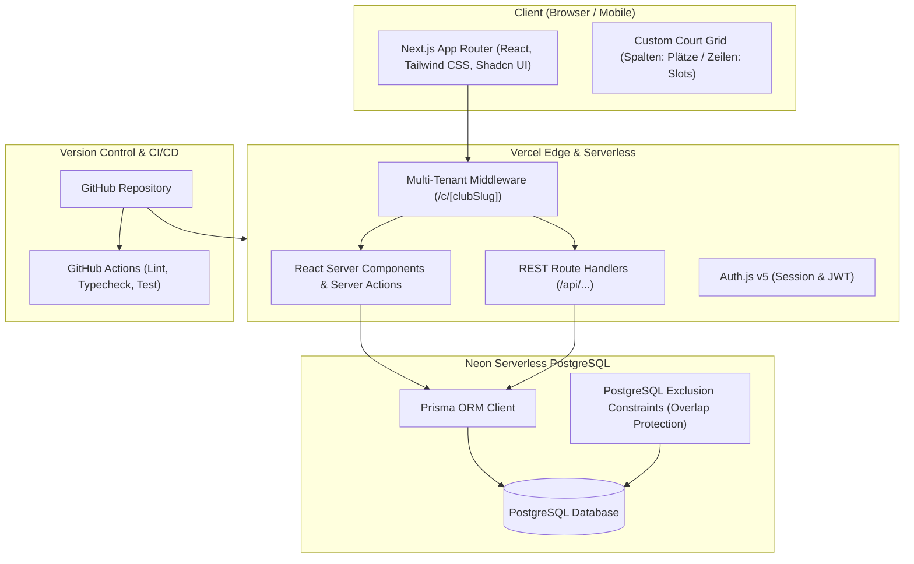

# Etappenbauplan: Tennis Reservation App

Dieser Bauplan definiert die schrittweise Entwicklung der mandantenfähigen Tennis-Reservierungsplattform basierend auf den abgestimmten Architekturentscheidungen und dem Fachkonzept ([konzept.md](file:///Users/alain/TennisCourts/konzept.md)).

---

## 1. Übersicht & Ziel-Architektur

| Bereich | Technologie | Zweck |
| :--- | :--- | :--- |
| **Framework** | Next.js (App Router, React 19 / TypeScript) | Full-Stack Webframework mit RSC und Server Actions |
| **Styling & UI** | Tailwind CSS + Shadcn UI (Radix Primitives) + Lucide Icons | Barrierefreies, responsives Mobile-First UI mit individuellem Tennis-Kalender |
| **Datenbank** | Neon PostgreSQL (Serverless) | Relationale DB mit Branching-Support und nativen Überlappungs-Constraints |
| **ORM / Migration** | Prisma ORM | Typsichere Datenbankabfragen und schema-gesteuerte Migrationen |
| **Authentifizierung** | Auth.js (NextAuth v5) mit Prisma-Adapter | E-Mail/Passwort, Session-Handling, RBAC (6 Rollen) |
| **Multi-Tenancy** | Path-basiert (`/c/[clubSlug]/...`), Tenant-Context Middleware | Vollständige Daten- und Rechttrennung zwischen Tennisclubs |
| **Hosting & CI/CD** | Vercel + GitHub + GitHub Actions | Automatisches Preview- & Production-Deployment bei jedem Git-Push |

---

## 2. Phasenplan (Etappenbauplan)

### Phase 1: Projekt-Fundament, Git & Tooling
**Ziel:** Lauffähige Next.js-Basis mit Tooling, Formatierung, UI-Komponentenbibliothek und sauber initialisiertem Git-Repository.

- [x] **1.1 Next.js App initialisieren**: Next.js 16 (TypeScript, Tailwind CSS v4, ESLint, App Router, `src/`-Verzeichnis).
- [x] **1.2 Git & GitHub Setup**:
  - `git init`, `.gitignore` konfiguriert (inkl. `.env.example`, Next.js, Prisma).
  - Git Commits erstellt auf Branch `main`.
  - GitHub Actions Workflow angelegt.
- [x] **1.3 UI-Grundgerüst mit Shadcn UI**:
  - UI-Komponenten (`Button`, `Card`, `Badge`), `cn`-Utility und `lucide-react` Icons.
  - Landingpage mit Club-Finder, Feature-Übersicht und Emerald-Tennisthema.
- [x] **1.4 GitHub Actions CI Workflow**:
  - `.github/workflows/ci.yml` für Linting, TypeScript-Check und Next.js Build-Validierung.

---

### Phase 2: Datenbankmodell, Neon Postgres & Prisma
**Ziel:** Vollständig modelliertes Schema in Prisma mit Neon-Postgres-Verbindung, Seed-Skript und Schutz vor Doppelbuchungen.

- [ ] **2.1 Neon PostgreSQL Provisionierung**:
  - Neon-Projekt erstellen, Verbindungszeichenfolgen (`DATABASE_URL`, `DIRECT_URL`) in `.env.local` eintragen.
- [x] **2.2 Prisma Schema Definition**:
  - Alle Tabellen aus dem Fachkonzept in `prisma/schema.prisma` definiert:
    - `User`, `Tenant`, `TenantUser` (6 Rollen)
    - `Location`, `Court` (Sand, Hartplatz, Halle, Beleuchtung)
    - `MembershipPlan`, `Membership` (Quoten, Fenster, Dauern)
    - `Booking`, `BookingParticipant`, `CourtBlock`
    - `AuditLog` & NextAuth-Tabellen (`Account`, `Session`, `VerificationToken`)
  - Prisma Client erfolgreich generiert (`prisma/schema.prisma` -> `@prisma/client`).
- [x] **2.3 Doppelbuchungsschutz (Exclusion Constraint)**:
  - `prisma/exclusion_constraint.sql` für atomare Überlappungsverhinderung (`btree_gist` Extension) bereitgestellt.
- [x] **2.4 Seeding-Skript**:
  - `prisma/seed.ts` mit Demo-Club ("TC Rot-Weiss Zürich"), 4 Plätzen, 3 Mitgliedern, Tarifen und Beispiel-Buchungen erstellt.

---

### Phase 3: Authentifizierung & Multi-Tenancy Routing
**Ziel:** Sichere Benutzeranmeldung, Rollenprüfung und URL-Routing für Clubs.

- [ ] **3.1 Auth.js (v5) Setup**:
  - Credentials-Provider mit `bcryptjs` / `argon2` Passwort-Hashing.
  - NextAuth-Prisma-Adapter Integration.
  - Registrierungs- und Login-Formulare mit Zod-Validierung.
- [ ] **3.2 Multi-Tenant Routing & Middleware**:
  - Routen-Layout:
    - `/` Landingpage / Club-Finder.
    - `/login`, `/register`.
    - `/admin` Plattform-Administration (nur für `PLATFORM_ADMIN`).
    - `/c/[clubSlug]` Club-Home, Plätze, Kalender.
    - `/c/[clubSlug]/admin` Club-Management (nur für Club-Admins).
  - Next.js Middleware zur Validierung des Club-Slugs und Rollenprüfung.
- [ ] **3.3 Tenant-Context Helper**:
  - Typsichere Session- und Tenant-Extraktoren für Server Components und Server Actions.

---

### Phase 4: Club-, Platz- & Sperrzeiten-Verwaltung (Admin)
**Ziel:** Administratoren können ihren Club, Standorte, Plätze und Sperren vollständig konfigurieren.

- [ ] **4.1 Club-Einstellungen**: Club-Stammdaten, Öffnungszeiten, Zeitzone (z. B. `Europe/Zurich`).
- [ ] **4.2 Standort- & Platzverwaltung**:
  - Plätze anlegen, umbenennen, sortieren, Plaztattribute (Indoor, Sand, Flutlicht) pflegen.
- [ ] **4.3 Platzsperren (Court Blocks)**:
  - Formular zum Sperren von Plätzen (Wartung, Regen, Turnier).
  - Kollisionswarnung für bereits bestehende Buchungen.
- [ ] **4.4 Mitgliederverwaltung**:
  - Mitglieder einsehen, Rollen vergeben, Mitgliedschaften zuweisen.

---

### Phase 5: Buchungs-Engine & Regelprüfung (Core Domain)
**Ziel:** Transaktionales Buchungssystem mit flexibler Regelprüfung.

- [ ] **5.1 Zentrale Regelprüfung (`checkBookingEligibility`)**:
  - Prüfung von:
    - Buchungsfenster (z. B. maximal 7 Tage im Voraus).
    - Buchungskontingent (z. B. max. 4 zukünftige Buchungen).
    - Erlaubte Buchungsdauern (60 Min, 90 Min).
    - Erlaubte Spielzeiten und Wochentage gemäß Mitgliedschaftstarif.
    - Sperrzeiten und Club-Öffnungszeiten.
- [ ] **5.2 Transaktionale Buchungserstellung**:
  - Prisma Transaction (`$transaction`) mit Idempotency-Handling.
  - Teilnehmer-Zuordnung (`BookingParticipant`).
  - Audit-Log-Eintrag.
- [ ] **5.3 Stornierungslogik**:
  - Prüfung der Club-Stornierungsfrist (z. B. bis 24h vor Spielbeginn für Mitglieder, jederzeit für Admins).
  - Freigabe des Zeitslots und Benachrichtigungsauslöser.

---

### Phase 6: Interaktives Buchungs-UI (Court Grid Kalender)
**Ziel:** Flüssige, responsive Buchungsoberfläche für Mobile und Desktop.

- [ ] **6.1 Maßgeschneidertes Tennis-Court-Grid**:
  - Tagesansicht: Plätze als Spalten, Uhrzeiten (30-/60-Minuten-Intervalle) als Zeilen.
  - Mobile Ansicht: Wischbar / kompakte Umschaltung zwischen Plätzen.
  - Farbliche Indikatoren: Frei, Gebucht, Eigene Buchung, Gesperrt.
- [ ] **6.2 Buchungs-Modal**:
  - Start-/Endzeit, Mitspieler-Suche bzw. Gastnamen-Eingabe.
  - Direkte Anzeige von Regelverstößen oder Hinweisen (z. B. "Kontingent erreicht").
- [ ] **6.3 Kalender-Navigation & Filter**:
  - Datumsauswahl (Date Picker), Vor/Zurück-Buttons, Filter nach Indoor/Outdoor/Belag.

---

### Phase 7: Spieler-Dashboard & Profil
**Ziel:** Mitglieder können ihre Buchungen verwalten und Profile bearbeiten.

- [ ] **7.1 Mein Bereich**:
  - Übersicht der anstehenden und vergangenen Buchungen.
  - Schnell-Storno-Funktion mit Bestätigungsdialog.
- [ ] **7.2 Benutzerprofil**:
  - Kontaktdaten, Telefonnummer, bevorzugte Spielzeiten, Passwort ändern.

---

### Phase 8: Deployment, Vercel & GitHub Actions CI/CD
**Ziel:** Produktionsreifes Deployment auf Vercel mit Preview-Deployments für Pull Requests.

- [ ] **8.1 Vercel Projektverbindung**:
  - Verknüpfung mit GitHub-Repository.
  - Hinterlegung aller Environment-Variablen (`DATABASE_URL`, `AUTH_SECRET`, etc.).
- [ ] **8.2 Automatisierte Migrationen im Build-Prozess**:
  - `prisma migrate deploy` im Vercel Build Step oder per GitHub Action.
- [ ] **8.3 Smoke- & E2E-Tests**:
  - Grundlegende Tests für Buchungsworkflow und Tenant-Isolierung.

---

### Phase 9: Nach dem MVP (Erweiterungen)
- Stripe Online-Zahlungen (Gastbuchungen & Platzgebühren).
- E-Mail-Transaktionsmails via Resend oder Postmark.
- Öffentliche Matches & Mitspielersuche.
- Erweiterte Club-Statistiken & Auslastungsberichte.

---

## 3. Sofortige nächste Schritte zur Umsetzung

1. **Phase 1 starten:**
   - Next.js Projekt im aktuellen Verzeichnis initialisieren.
   - Git initialisieren, `.gitignore` aufsetzen, initialen Commit erstellen.
   - Shadcn UI und Tailwind einrichten.
2. **Neon-Datenbank anbinden:**
   - Neon-Projekt erstellen und Verbindungsdaten hinterlegen.
   - Prisma initialisieren und Schema aus [konzept.md](file:///Users/alain/TennisCourts/konzept.md) übertragen.
